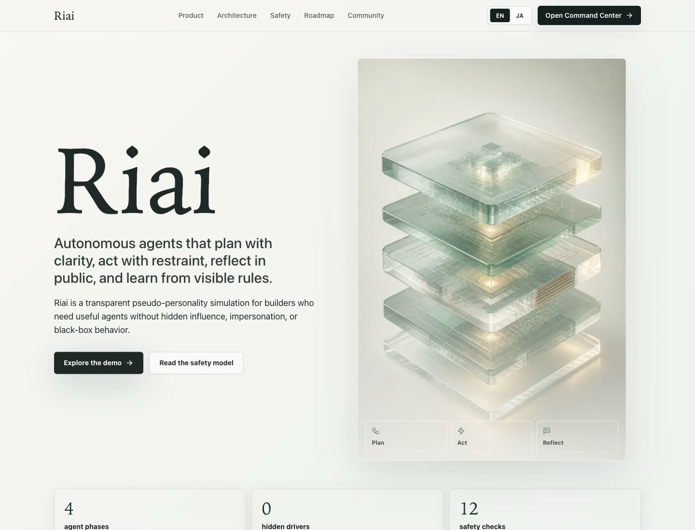

# Riai Website

Premium bilingual landing site and interactive command-center mock dashboard for **Riai**, a calm and transparent autonomous-agent brand.

## Status

- Local build: passing
- Deployment URL: https://takaki-sakamoto-g1359402.github.io/riai-website/
- GitHub repository: https://github.com/takaki-sakamoto-g1359402/riai-website
- Screenshot: captured locally
- GitHub Pages workflow: passing on `main`

## Design Direction

Riai should feel warm, precise, futuristic, trustworthy, and quietly powerful. The visual system uses:

- Pearl and celadon surfaces with graphite typography
- A deep blue-green command rail for operational contrast
- Lightweight glass/depth panels and a generated computational-core hero asset
- Optimized WebP hero media with a compressed PNG fallback
- Editorial scale in marketing sections, denser operational UI inside the Command Center
- Visible state, memory, task, safety, and rule surfaces so the simulated agent behavior stays inspectable

Reference sites were used only for abstract patterns such as information architecture, pacing, typography hierarchy, dashboard density, material-state clarity, and launch polish. No protected layouts, assets, copy, logos, colors, trade dress, animations, or code were copied.

## Tech Stack

- Vite
- React
- TypeScript
- Tailwind CSS
- Framer Motion
- Lucide React icons

## Setup

Node.js 22 or newer is recommended. The CI workflow uses Node 22.

```bash
npm install
npm run dev
```

The local app runs through Vite. By default Vite prints the localhost URL in the terminal.

## Scripts

```bash
npm run dev       # Start development server
npm run build     # Type-check and create static dist/
npm run preview   # Preview the production build locally
npm run lint      # Run ESLint
npm run validate  # Confirm files, scripts, dist output, Pages workflow, accessibility gates, and asset budgets
npm run smoke     # Start production preview and verify HTML/assets over HTTP
npm run qa        # Run lint, build, validate, and smoke in release order
```

## Interactions

- `EN / JA` language toggle changes all primary copy.
- Command Center phase tabs switch between `Plan`, `Act`, `Reflect`, and `Learn`.
- Dashboard panels expose simulated active agents, safety checks, memory, rule status, task timeline, and activity.
- The community CTA currently returns visitors to the Command Center demo until a real public repository or discussion URL is approved.
- Navigation uses semantic anchors and keyboard-focusable controls.
- Motion respects `prefers-reduced-motion`.

## Screenshots

Browser QA screenshots are available at:



Desktop: `public/screenshots/riai-home.png`
Mobile: `public/screenshots/riai-mobile.png`

## Deployment

The site is live on GitHub Pages:

https://takaki-sakamoto-g1359402.github.io/riai-website/

The site is static and can also be deployed from `dist/` to Vercel, Netlify, or Cloudflare Pages.

`vite.config.ts` uses a relative build base so the generated assets work on GitHub Pages project URLs such as `/repository-name/` as well as custom domains.
Run `npm run build` before `npm run validate` because validation checks the generated `dist/` output.

Approval-gated release steps are tracked in [`docs/RELEASE_CHECKLIST.md`](docs/RELEASE_CHECKLIST.md).
Current non-browser QA evidence is tracked in [`docs/LOCAL_QA_REPORT.md`](docs/LOCAL_QA_REPORT.md).
`npm run smoke` verifies the local production preview without opening a browser. Use `npm run qa` before release because it rebuilds `dist/` before validation and smoke checks.

GitHub Pages deployment is handled by `.github/workflows/pages.yml` on pushes to `main` and manual `workflow_dispatch`. The workflow runs `npm ci`, `npm run lint`, `npm run build`, `npm run validate`, and `npm run smoke`, then deploys the generated `dist/` artifact.

Latest verified deployment evidence:

- GitHub Pages source: GitHub Actions
- Successful workflow run: https://github.com/takaki-sakamoto-g1359402/riai-website/actions/runs/27371001274
- Live URL check: `200 OK`
- Browser QA: live desktop and mobile views loaded without console warnings or errors

## Legal Note

Riai is an original autonomous-agent concept. Demo content is simulated and does not represent real customers, production deployments, safety certification, or live account integrations.

The supplied reference URLs were studied only for abstract design and release patterns. This project must not copy protected layouts, text, logos, imagery, brand names, color systems, trade dress, animations, or source code from those references.
